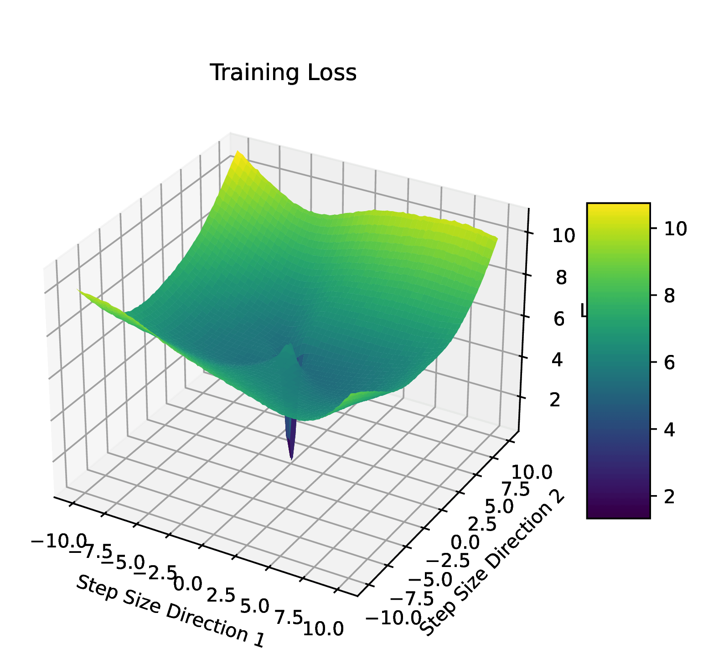

# Grokking

An implementation of OpenAI's 'Grokking: Generalization Beyond Overfitting on Small Algorithmic Datasets' paper in PyTorch.


## Installation

* Clone the repository and navigate into the directory:
    ```bash
    git clone https://github.com/danielmamay/grokking.git
    cd grokking
    ```
* Ensure you are using Python 3.9 or later:
    ```bash
    conda create -n grokking python=3.9
    conda activate grokking
    pip install -r requirements.txt
    ```

## Usage

The project utilizes [Weights & Biases](https://wandb.ai/site) for experiment tracking. Run `wandb login` to use the online dashboard, or use `wandb offline` to store the experiment data locally.

* To execute a single experiment:
    ```bash
    wandb login
    python grokking/cli.py
    ```

* To execute a grid search using W&B Sweeps:
    ```bash
    wandb sweep sweep.yaml
    wandb agent {entity}/grokking/{sweep_id}
    ```

## Experimental Insights

This project builds on recent research that explores the phenomenon of **Grokking**, where validation accuracy improves dramatically well after training accuracy has plateaued, especially in small dataset settings. The goal is to investigate when, why, and how grokking occurs, focusing on transformers and multi-layer perceptrons (MLPs) under various conditions.


### Grokking on Transformers (Arithmetic Data)

We trained a **decoder-only transformer model** on arithmetic datasets, with operations like addition, subtraction, multiplication, and division modulo a prime number \( p \). The model architecture consists of two transformer layers with four heads. For optimization, we used the AdamW optimizer, with Cross Entropy loss and Weight Decay regularization.

<p align="center">
  
</p>

### WHEN are Transformers not Grokking?

Our experiments on transformers showed that the ratio of the training dataset size to batch size plays a crucial role in determining whether grokking occurs. We found a specific region, dubbed the **comprehension band**, where grokking delays are shorter. This band is associated with a training dataset to batch size ratio consistently in the range of 100–800.

<p align="center">
  
</p>

### WHY are Transformers Grokking?

The loss landscape for grokking versus non-grokking solutions shows notable differences. Grokking optima tend to have a much rougher loss landscape, with variations up to 8x larger. We also observed that the norm of attention weights spikes significantly during grokking, indicating an instability that aligns with validation improvements over time.

<p align="center">
  
  
</p>

## References

Code:

* [openai/grok](https://github.com/openai/grok)

Paper:

* [Grokking: Generalization Beyond Overfitting on Small Algorithmic Datasets](https://arxiv.org/abs/2201.02177)
